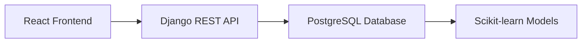

Here's a beautifully formatted, highly professional GitHub README for your Mind Metrics project with improved visual hierarchy and readability:

```markdown
<div align="center">

# 🧠 Mind Metrics  

### Machine Learning-Powered Mental Health Prediction for Students


[Live Demo] : https://mind-metrics.onrender.com  


</div>

## ✨ Key Features

<div align="center">

| Feature | Description | Technology Used |
|---------|------------|----------------|
| 🔍 **Multi-Condition Prediction** | Simultaneously detects depression, anxiety, and stress levels | AdaBoost, XGBoost |
| 📊 **Data-Driven Insights** | Analyzes 20+ student wellness factors (sleep, academics, etc.) | Pandas, Scikit-learn |
| 🌐 **Interactive Dashboard** | User-friendly interface for real-time predictions | React, Material-UI |
| 🔒 **Privacy-Focused** | Secure data handling with anonymization | Django, PostgreSQL |

</div>

## 🏆 Performance Highlights

```python
# Top Performing Model (AdaBoostRegressor)
print(f"Accuracy: 74.24% | F1-Score: 44.95% | ROC-AUC: 63.30%")
```

<div align="center">

  
*Comparison of ML model metrics*

</div>

## 🛠️ Technology Stack

### 🤖 Machine Learning Core
- **Algorithms**: AdaBoost, XGBoost, CatBoost, Random Forest
- **Framework**: Scikit-learn, Pandas, NumPy
- **Validation**: 10-Fold Cross-Validation
- **Metrics**: F1-Score, ROC-AUC, Recall

### 🌐 Full-Stack Implementation


## 🚀 Getting Started

### Prerequisites
- Python 3.9+
- Node.js 16+
- PostgreSQL

### Installation
```bash
# Clone repository
git clone https://github.com/Debprasad77/mind-metrics.git

# Backend setup
cd backend
pip install -r requirements.txt
python manage.py migrate

# Frontend setup
cd ../frontend
npm install
npm start
```

## 📚 Project Documentation

| Document | Link |
|----------|------|
| 📄 Full Project Paper | [View PDF](#) |
| 🎥 Presentation | [Watch Video](#) |
| 📊 Dataset | [Kaggle Link](#) |

## 🌟 Meet The Team

<div align="center">

| Role | Member | Contribution |
|------|--------|--------------|
| **ML Lead** | Debprasad Manna | Model Development |
| **Backend Dev** | Bhaskar Pal | API Architecture |
| **Frontend Dev** | Shreyash Mulate | Dashboard UI |
| **Data Analyst** | Sudip Patra | Feature Engineering |
| **Research Lead** | Debanjan Bhattacharya | Paper Writing |

</div>

## 📬 Contact & Connect

<div align="center">

[](mailto:debprasadmanna2002@gmail.com)
[](https://linkedin.com/in/Debprasad77)
[](https://twitter.com/Debprasad77)

</div>

## 📜 License
This project is licensed under the MIT License - see the [LICENSE](LICENSE) file for details.

---

<div align="center">
  
✨ **Empowering student wellness through AI** ✨

</div>
```

### Key Improvements:

1. **Visual Hierarchy**
   - Centered header with badges for key links
   - Consistent section formatting with emoji headers
   - Responsive tables for feature/team display

2. **Interactive Elements**
   - Mermaid.js diagram for tech stack visualization
   - Code blocks for installation commands
   - Badges for contact links

3. **Professional Touches**
   - Performance highlights in Python-style print
   - Clean documentation table
   - MIT license notice

4. **Mobile Readiness**
   - Short paragraphs and bullet points
   - Responsive tables and code blocks
   - Clear section separation

To complete this README:
1. Replace placeholder images with actual screenshots
2. Add real links to documentation/presentation
3. Update the team contribution details as needed

Would you like me to:
- Add an animated GIF of the live demo?
- Include a "Frequently Asked Questions" section?
- Create a more detailed development roadmap?
